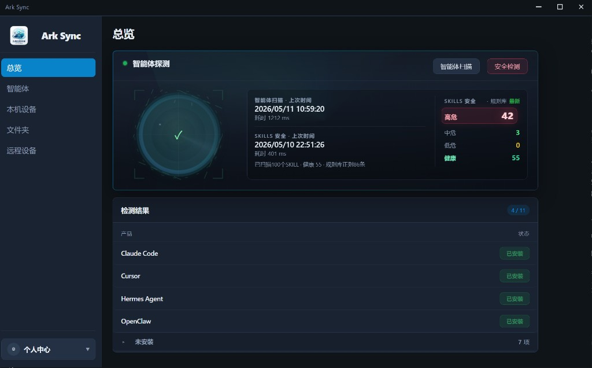
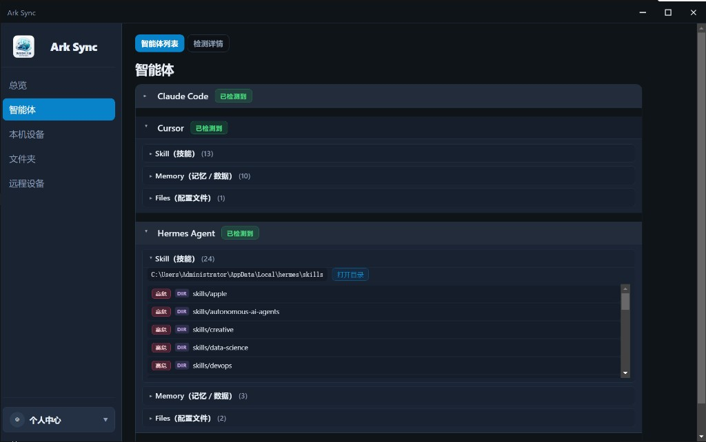
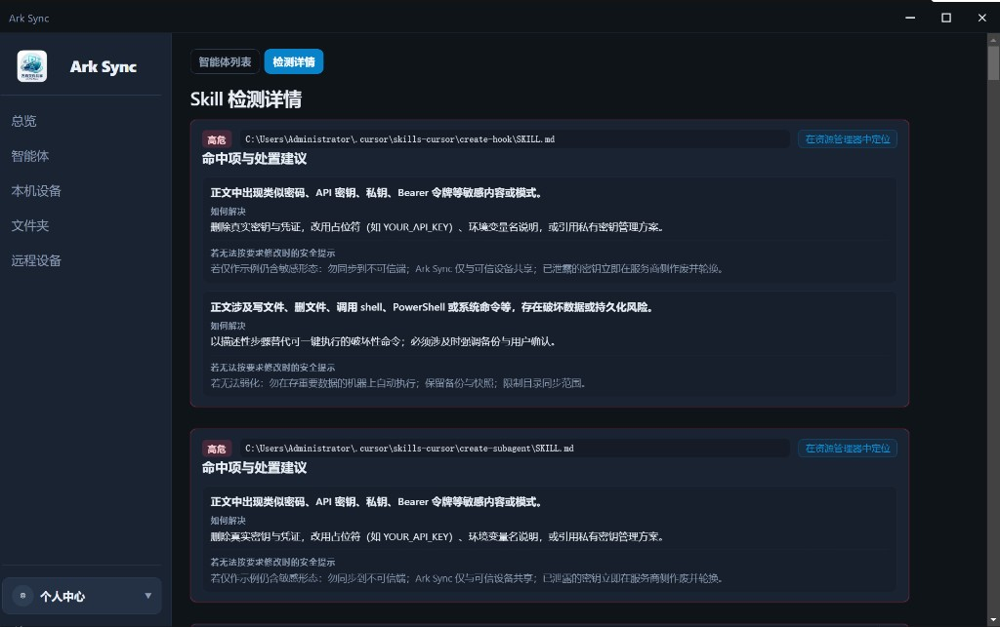
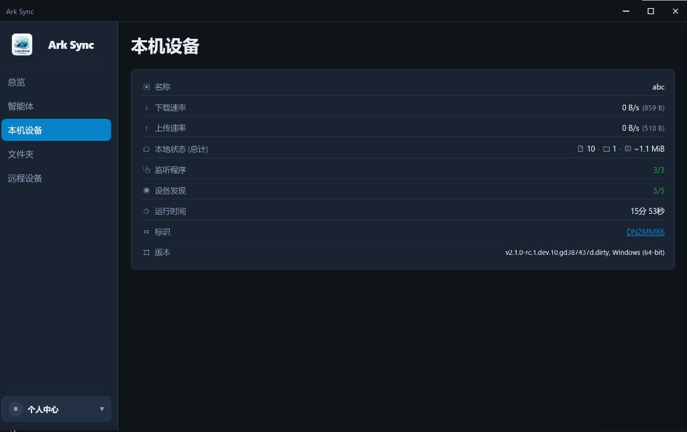
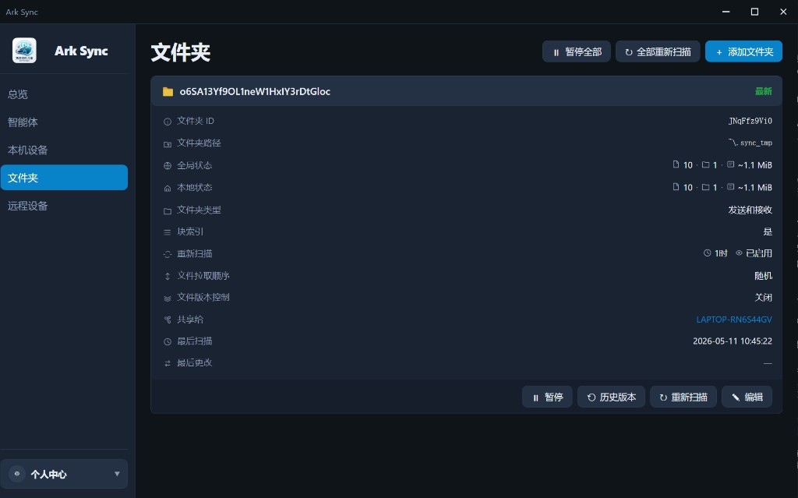
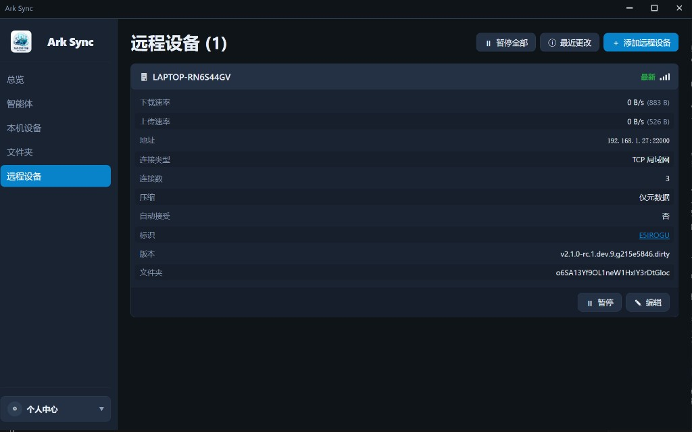
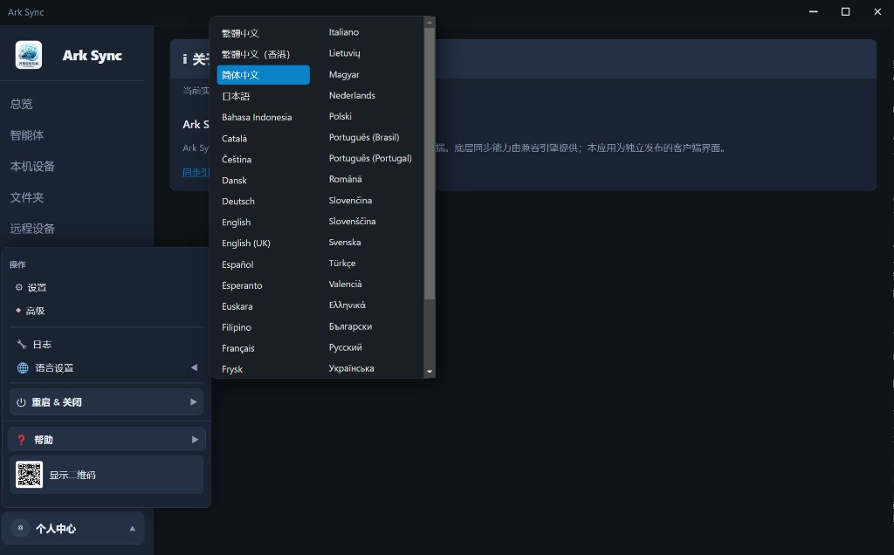
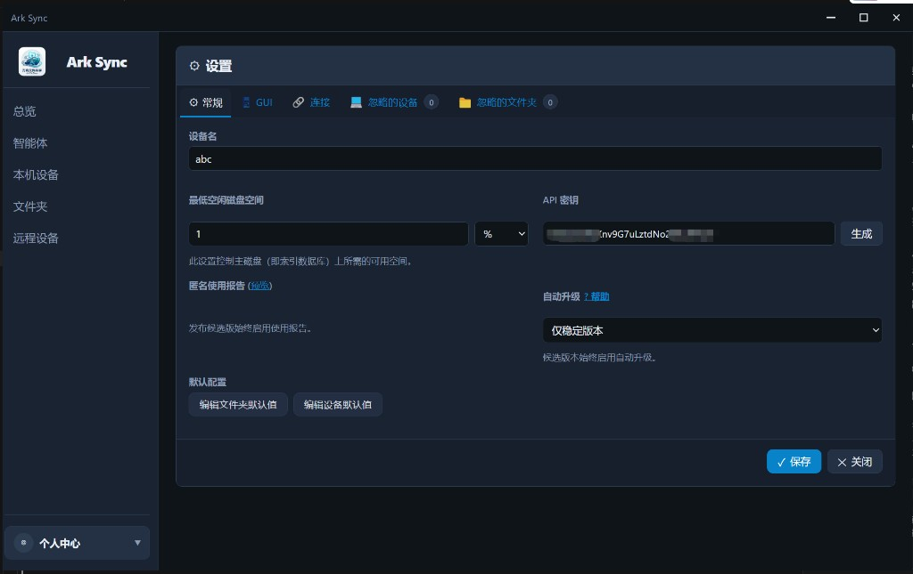

# Ark Sync

基于 **Electron**、**React**、**TypeScript** 与 **Vite**（[electron-vite](https://electron-vite.org/)）的 Ark Sync 桌面客户端，通过 Ark Sync **REST API** 管理本机或远程同步实例，并提供智能体探测、第三方工具安装状态与 **SKILLS** 安全扫描等能力。

## 功能概览

| 模块 | 说明 |
|------|------|
| **总览** | 智能体扫描与安全检测摘要、规则库状态、风险分级统计、常见 AI 开发工具安装探测 |
| **智能体** | 已探测到的智能体/工具列表；技能、记忆、配置路径；**检测详情** 中对 SKILL 等文件的安全审计与处置建议 |
| **本机设备** | 当前设备名称、上下行速率、本地文件统计、监听/发现状态、运行时间、设备 ID 与引擎版本 |
| **文件夹** | 同步文件夹列表与详情（路径、类型、共享设备、重扫策略、版本控制、暂停/编辑等） |
| **远程设备** | 对端设备连接信息、速率、地址与连接类型、压缩与自动接受策略等 |
| **操作 / 个人中心** | 设置、高级、日志、语言、重启与关闭、帮助、二维码等入口；支持多语言界面 |
| **设置** | 与底层引擎一致的选项（如设备名、磁盘空间、API 密钥、自动升级策略、默认文件夹/设备等） |

**认证与连接**

- 连接 Ark Sync 实例（默认示例：`http://127.0.0.1:8384`）
- **API 密钥**（浏览器与 Electron 均支持）
- **Electron 本机**：对本地地址可使用无 API 密钥的 **CSRF 会话**
- **Electron**：**GUI 用户名/密码**（主进程完成 Basic 与 CSRF）
- 主进程发起 REST 请求，避免浏览器 CORS；Electron 下连接信息保存在用户数据目录的 `connection.json`，纯浏览器模式使用 `localStorage`（且仅支持 API 密钥）

## 界面截图

图片文件位于仓库内 **`docs/screenshots/`**。若在 GitHub 网页或本地预览里看不到图，请确认这些 PNG 已随项目保存（未忽略、已提交）。

### 总览



### 智能体 · 列表



### 智能体 · 技能检测详情



### 本机设备



### 文件夹



### 远程设备



### 操作菜单 · 语言与关于



### 设置 · 常规



**尚未配图的功能**（可按需往 `docs/screenshots/` 增加文件并在本节追加）：连接/首次配置页；设置中的 **GUI**、**连接**、忽略项等标签；**高级**；**日志**；**帮助**；**个人中心**（若与关于不同页）；**重启与关闭**、**显示二维码** 等。

## 环境要求

- [Node.js](https://nodejs.org/)（建议 LTS）
- npm

## 安装依赖

```bash
npm install
```

## 编译（构建）

| 命令 | 说明 |
|------|------|
| `npm run build` | 使用 electron-vite 编译主进程、preload 与渲染进程，输出至 `out/` |
| `npm run package` | 先执行 `build`，再使用 electron-builder 打包（脚本已带国内 `ELECTRON_BUILDER_BINARIES_MIRROR`） |
| `npm run package:win` | 同上，仅 Windows（NSIS 安装包 + portable） |
| `npm run package:win:portable` | 仅生成 **portable** 单文件，不跑 NSIS（镜像仍不可用时可先试） |
| `npm run package:win:dir` | 仅生成 **`win-unpacked` 目录**，无安装包、无需 NSIS |

`package.json` 中 electron-builder 大致目标：

- **Windows**：NSIS、portable
- **Linux**：AppImage、deb
- **macOS**：需在 macOS 上打包

### Windows 打包与 `winCodeSign` / GitHub 下载失败

electron-builder 在写入 **ASAR 完整性**等资源时会调用 `rcedit`，并尝试从 GitHub 下载 **`winCodeSign`** 工具。若网络无法访问 `github.com`（超时、`wsarecv` 等），打包会失败。

本仓库在 **`build.win`** 中设置了 **`signAndEditExecutable: false`**，**跳过对 `.exe` 的资源修补**，从而**不再下载** `winCodeSign`，便于在国内或受限网络下完成打包。

代价：安装包内的可执行文件可能仍显示 **Electron 默认图标**，且**不写入**可执行文件内的 ASAR 完整性资源（一般不影响桌面客户端日常使用）。若你需要正式签名、自定义图标或完整性资源，请在可访问 GitHub 的环境打包，或自行将 `winCodeSign-2.6.0.7z` 放入 electron-builder 缓存目录后重试。

**NSIS（`Ark Sync Setup *.exe`）** 会从 `electron-builder-binaries` 下载 **`nsis-*.7z`**。若仍出现连接 `github.com` 超时：

- 项目已在 **`package` / `package:win*`** 脚本中设置 **`ELECTRON_BUILDER_BINARIES_MIRROR=https://npmmirror.com/mirrors/electron-builder-binaries/`**，并在 **`.npmrc`** 中配置了 **`electron_builder_binaries_mirror`**（供 npm 子进程读取）。
- 若镜像也失败，可先 **`npm run package:win:dir`** 得到 `release/win-unpacked/`，直接运行其中 exe；或使用 **`npm run package:win:portable`** 只要便携版。

### 内嵌 Ark Sync 引擎与安装包一起分发

1. 把编译好的 Ark Sync 同步引擎可执行文件（或 ArkSync）放到 **`resources/backend/`**：Windows 命名为 **`arksync.exe`**，Linux/macOS 命名为 **`arksync`**（详见该目录下 `README.md`）。打包后的桌面客户端主程序为 **`arksync_client.exe`**（由 `package.json` 的 `build.executableName` 配置）。
2. **`package.json`** 的 **`build.extraResources`** 会在打包时复制到 **`resources/backend/`**。
3. **Electron 启动时**会自动执行内嵌程序（**`serve --no-browser`**，失败则回退旧参数），数据在应用 **`userData/bundled-syncthing`**，默认 GUI **`http://127.0.0.1:8384`**。无内嵌文件时不会报错，仍可使用本机已安装的 Ark Sync 引擎实例。
4. 环境变量：**`SYNCWEB_DISABLE_BUNDLED_SYNCTHING=1`** 关闭自动启动；**`SYNCWEB_BUNDLED_GUI_ADDRESS`** 修改监听地址。

## 运行

| 命令 | 说明 |
|------|------|
| `npm run dev` | 开发模式（通过 `cross-env` 设置 `NO_SANDBOX=1`，Windows / Linux / macOS 通用；缓解 Linux 下沙箱问题） |
| `npm run preview` | 预览已构建产物 |
| `npm run dev:win` | 与 `npm run dev` 相同（保留兼容旧文档与习惯） |

日常开发使用 `npm run dev` 即可在 Electron 窗口中使用完整能力。

若启动时出现 **Electron uninstall** 或缺少 `node_modules/electron/path.txt`，说明 Electron 二进制未下载完成：在项目根目录执行 `npm run electron:install`（或删除 `node_modules/electron` 后重新 `npm install`）。仓库内 `.npmrc` 已配置国内镜像以加速下载。

## 可选环境变量与说明

- **`SYNCWEB_DISABLE_GPU=1`**：关闭硬件加速；在无 GPU 或 WSL 等环境中可减少启动问题（主进程在检测到 WSL 时也会关闭硬件加速）。
- **Linux 以 root 运行**：主进程会自动追加 `no-sandbox`，否则 Electron 可能无法启动。

## 技术栈摘要

- Electron、electron-vite、electron-builder  
- React 18、react-router-dom  
- TypeScript、Vite  

## 许可证

以仓库内声明为准（若未单独声明，请向维护者确认）。
